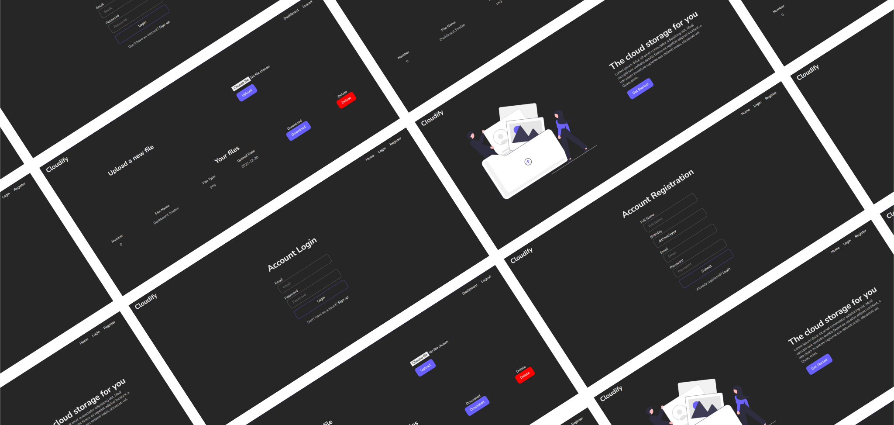

<a name="readme-top"></a>
<!-- Head section -->
<div align="center">
  <a href="https://github.com/Eiliv17/CloudStorageWebApp">
    
  </a>

  <h1 align="center">Cloud Storage Web App</h1>

  <p align="center">
    A simple web app to store your files in the cloud.
  </p>
</div>

<!-- Table of contents -->
<details>
  <summary>Table of Contents</summary>
  <ol>
    <li>
      <a href="#about-the-project">About The Project</a>
      <ul>
        <li><a href="#built-with">Built With</a></li>
      </ul>
    </li>
    <li>
      <a href="#getting-started">Getting Started</a>
      <ul>
        <li><a href="#mongodb-server">MongoDB Server</a></li>
        <li><a href="#env-file">.env File</a></li>
      </ul>
    </li>
    <li><a href="#license">License</a></li>
  </ol>
</details>

<!-- About the project section -->
## About The Project

This is my first project trying to build a full server side rendering website, I've decided to use the Gin framework and the Go language for their performance handling a huge amount of requests efficiently and fast.

The project is still a work in progress, for now you can only register and login an account and once you've logged in you can upload and download files. The basic functionality is there but the code need a little bit of cleaning and refactoring, and also the styling needs an update and maybe a cleaner CSS stylesheet. Also the design for now only works in desktop view, since I followed a desktop first approach.

<p align="right">(<a href="#readme-top">back to top</a>)</p>


<!-- Built with section -->
### Built With

This project was built with the following technologies:

- 
- 
- 
- 

To be more specific the project uses JWT for making requests once logged in, and the password are stored securely inside MongoDB since they're hashed using the bcrypt algorithm with a cost of 10. The Gin Web Framework handles all requests and serves HTML using Go's tamplating library.

<p align="right">(<a href="#readme-top">back to top</a>)</p>


<!-- Getting started section -->
## Getting Started
Before you run the app you need to have the following:
- MongoDB Server
- .env File

<p align="right">(<a href="#readme-top">back to top</a>)</p>

### MongoDB Server
You need to have MongoDB installed on your machine, if you don't have it installed you can download the installer at the following [link](https://www.mongodb.com/try/download/community). 

This link is for the community version of MongoDB, once you've completed the installation process, it should be already up and running.

<p align="right">(<a href="#readme-top">back to top</a>)</p>
### .env File
In the root of your project folder you also need to create a .env file which will load the environment variables that are needed for the web app to work. 

The app requires the following environment variables:

Variable                    | Description
---                         | ---
PORT                        | The HTTP server port
MONGODB_URI                 | The URI for connecting to your MongoDB server
DB_NAME                     | The name of the database (inside MongoDB) where you want to store the users and files
HMAC_SECRET                 | The HMAC secret string

Here's an example of the .env file:
```
PORT=3000
MONGODB_URI= mongodb://127.0.0.1:27017/
DB_NAME=CloudStorageApp
HMAC_SECRET=Yp2s5v8y/B?E(H+MbQeThWmZq4t6w9z$C&F)J@NcRfUjXn2r5u8x/A%D*G-KaPdS
```
<p align="right">(<a href="#readme-top">back to top</a>)</p>

<!-- Usage section -->
## Usage
If you've followed the getting started correctly, you'll then be able to run the application by just compiling and running the main.go file.

<p align="right">(<a href="#readme-top">back to top</a>)</p>


<!-- license section -->
## License
[](https://www.gnu.org/licenses/gpl-3.0)

Distributed under the GPL v3 License. See [LICENSE](LICENSE) for more information.

<p align="right">(<a href="#readme-top">back to top</a>)</p>
